<!-- Header -->

  

  
  

---

## About Me

I am an Informatics Engineering student with an interest in software development, web applications, API development, and database systems.

I enjoy building practical digital solutions, exploring new technologies, and developing systems that are structured, reliable, and easy to use.

---

## Tech Stack

  

---

## Selected Projects

| Project                           | Description                                                                                                                            |
| --------------------------------- | -------------------------------------------------------------------------------------------------------------------------------------- |
| **SIAKAD MUSDA**                  | Web-based academic information system for managing students, teachers, classes, schedules, attendance, assignments, exams, and grades. |
| **Library Management System**     | Library system for managing administrators, members, books, and borrowing transactions.                                                |
| **Academic Chatbot**              | Academic chatbot that provides campus information, major recommendations, and assistance with SIAKAD issues.                           |
| **Pixel Adjust**                  | Image analysis system for adjusting brightness and contrast, downloading results, and analyzing pixel information.                     |
| **Indonesian → Batak Translator** | Language translation system for translating Indonesian text into Batak.                                                                |

---

## GitHub Statistics

  
  

---

## Contribution Activity

  <picture>
    <source
      media="(prefers-color-scheme: dark)"
      srcset="./profile/snake-dark.svg"
    />
    <source
      media="(prefers-color-scheme: light)"
      srcset="./profile/snake.svg"
    />
    
  </picture>

---

<h2 align="center">GitHub Trophies</h2>

  

---

## Focus

  
  
  
  

---

## Connect

  
  

 

  

